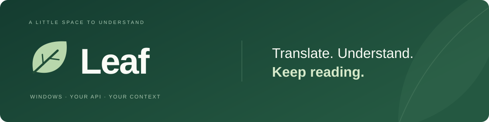
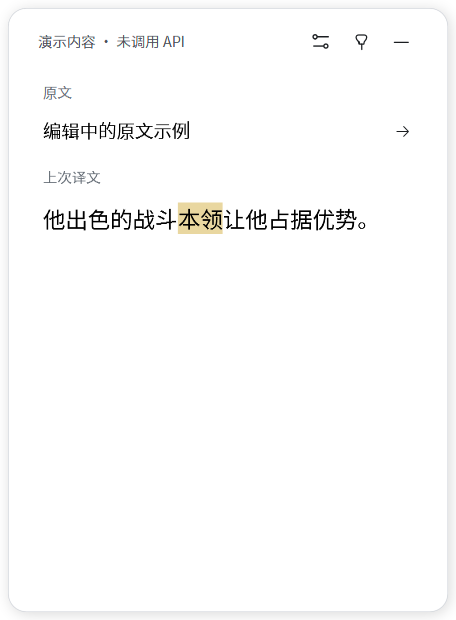
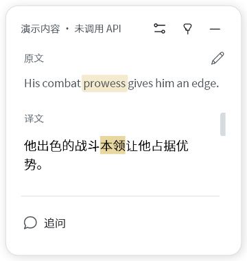

  

  <a href="https://github.com/Inmata/leaf-translate/releases/latest"><strong>下载 Windows 版</strong></a> ·
  <a href="#快速开始">快速开始</a> · <a href="#界面预览">界面预览</a> ·
  <a href="https://github.com/Inmata/leaf-translate/issues">问题反馈</a>

  
  
  

<strong>简体中文</strong> · <a href="README.en.md">English</a>

**读到不懂的词句，按一下快捷键。**

Leaf 是一款 Windows 桌面翻译工具。复制或选中文字，就能在小浮窗里查看译文；点击原文中的词继续学习，也可以围绕这段内容追问。

使用自己的 **OpenAI、智谱、千问、DeepSeek，或其他兼容服务的 API**。原文语言自动识别，目标语言和学习方式由你设置，适合阅读书籍、浏览网页、查看技术文档或理解游戏里的文字。

## 主要功能

- **随手翻译**：默认选中文字，再按 `Ctrl+Alt+T`；也可以开启剪贴板模式，先复制再翻译。
- **在原句里学词**：点击单词，查看当前语境下的释义、词性和原形，按偏好展开近义词、构词、搭配或例句。
- **接着问下去**：在同一浮窗里追问整句或某个词，原文和译文始终保留。
- **用选项设置学习方式**：选择阅读场景和学习内容；缺少合适选项时，再添加自己的要求。常用组合可以保存为预设。
- **回看本地历史**：搜索原文或译文，恢复词卡和对话，继续追问。默认保存最近 200 条，可删除、清空或关闭保存。
- **按自己的桌面习惯使用**：唤起时保留原软件焦点，支持置顶、拖动和调整大小，自动记住位置与尺寸；快捷键可改为 `Alt+Space`。
- **随时自己输入**：编辑原文，Enter 翻译；译文可以选中复制。阅读偏好自动保存，不用反复关闭设置。
- **模型自动适配**：填入密钥后自动获取模型，有清晰的状态反馈。高级选项可控制思考和输出上限，支持 GLM-5.3 / Flash 的轻量思考。

## 下载与安装

到 [Releases 下载最新版本](https://github.com/Inmata/leaf-translate/releases/latest)，选择 **`Leaf-v版本号-windows.zip`**，不要把 GitHub 自动生成的 `Source code` 压缩包当成运行程序。

1. 把 ZIP **完整解压**到一个固定文件夹。
2. 保持 `Leaf.exe` 和 `Leaf.exe.config` 在同一目录，双击 `Leaf.exe`。
3. 首次启动会打开设置。配置好 API 后即可使用。

| 项目 | 要求或说明 |
| --- | --- |
| 系统 | Windows 10 / 11 |
| 运行环境 | [.NET Framework 4.8](https://dotnet.microsoft.com/en-us/download/dotnet-framework/net48)；较新的 Windows 通常已包含 |
| 软件界面 | 当前版本为中文；提供完整英文文档 |
| 翻译语言 | 自动识别原文；目标语言默认中文，可修改 |
| API | 需要自己的 API 密钥和可用模型；用量由服务商计费 |

Leaf是便携程序。开机启动默认关闭，使用时会驻留在系统托盘。

## 快速开始

### 1. 配置翻译服务

先选择 **API 服务**，再填写它的 **API Key**：官方服务提供预设地址，其他服务选择「自定义兼容服务」并填写接口地址。确定接口后会自动获取模型，显示加载与结果；从列表选择支持文字对话的模型即可，也可点击 **「刷新模型」** 重试。保存后会记住接口，下次更换密钥自动刷新。

密钥本身不能可靠识别服务商，因此 Leaf 不会把它发给多个厂商试探。模型列表返回归属信息时会展示；接口未提供时不猜测，也不会自动选择付费模型。

| 服务商 | 官方说明 |
| --- | --- |
| OpenAI | [OpenAI API 文档](https://developers.openai.com/api/docs/) |
| 智谱 | [智谱开放平台文档](https://docs.bigmodel.cn/) |
| 千问 | [阿里云百炼文档](https://help.aliyun.com/zh/model-studio/) |
| DeepSeek | [DeepSeek API 文档](https://api-docs.deepseek.com/) |
| 其他兼容服务 | 填写提供方给出的 HTTPS 地址；需兼容 OpenAI Chat Completions |

模型框也能直接输入模型 ID。部分服务或兼容接口不提供模型列表，此时按官方文档填写即可；接口地址已提供默认值，可在展开项中修改。列表中出现的模型不代表账号已开通，仍需测试连接确认。

点击 **「测试连接」**，成功后点击 **「应用服务配置」**；应用后设置页保持打开。测试会发送一次短请求，可能计入 API 用量。模型是否可用、是否免费，以服务商账号和当前规则为准。

**「高级选项」** 默认收起。思考模式建议保持「自动适配」；GLM-5.3 / Flash 必须开启思考，默认使用轻量，也可选增强或深度。输出 token 上限可以留空自动设置；它包含思考和正文，过小可能截断回答，实际用量由服务商计费。

OpenAI 和自定义接口默认沿用模型的思考设置，不发送智谱／千问专用参数。模型目录可能包含图片、音频等模型，请选择支持文字对话的型号；当前使用 Chat Completions 协议，不支持只提供 Responses 或其他原生协议的服务。

没有密钥也可以先体验界面：在解压目录打开 PowerShell，运行 `.\Leaf.exe --demo`。演示内容会明确标记，不调用 API。

### 2. 翻译一段文字

新用户默认使用**选中模式**：

1. 在浏览器、阅读器或其他软件里选中文字。
2. 按 **`Ctrl+Alt+T`**，等待浮窗显示译文。

喜欢先复制再翻译，可以在托盘开启 **「剪贴板模式」**，或在设置中勾选 **「快捷键读取剪贴板」**，之后先按 `Ctrl+C`，再按翻译快捷键。部分软件无法直接取词，这时手动复制更可靠。升级会保留已有取词模式。

剪贴板模式只在你按快捷键时读取文字，每次复制不会自动触发翻译。

### 3. 查词与追问

点击原文中的词，展开词卡。例如读到 `prowess`，可以查看它在原句里的意思，并按「近义词比较」偏好了解它与 `power` 的区别。

遇到短语或不便逐词点击的文字，可以在浮窗原文中拖选一段，再右键选择 **「解释选中片段」**。

点击 **「追问」** 才会出现输入框。问题围绕当前词语或原句展开；点击 **「返回整句」** 可以切回原句。`Enter` 或轻量箭头按钮发送，`Shift+Enter` 换行。

### 4. 自己输入，或修改原文

没有取得选区时，快捷键安静唤起浮窗，保留上次页面、译文与草稿，不自动进入输入。有原文时点击右侧编辑图标，准备手动输入；开启直接输入选项后，成功取词会聚焦原文。`Enter` 或输入区右侧的箭头按钮提交，`Shift+Enter` 换行，每次手动提交建立新会话。清空草稿但未提交不会删除当前结果：再次对同一段文字按快捷键会恢复原会话的译文、词卡与追问，不重复请求。译文和学习内容可连续拖选，按 `Ctrl+C` 或右键复制。选中 Leaf 内的文字再按快捷键可继续翻译不同片段，并通过返回入口恢复原会话。

## 界面预览

以下截图来自 v0.5.0 的「清晰纸面」界面，文字、模型选项、问答、密钥状态与历史记录均为演示内容，未调用真实 API。点击图片可以查看大图。

<table>
  <tr>
    <td width="50%" align="center" valign="top">
       
      <strong>翻译与学习</strong> 原文、译文与连续可选的学习内容
    </td>
    <td width="50%" align="center" valign="top">
       
      <strong>同浮窗设置</strong> 配置服务，随时返回阅读
    </td>
  </tr>
  <tr>
    <td align="center" valign="top">
       
      <strong>继续追问</strong> 围绕当前词句深入理解
    </td>
    <td align="center" valign="top">
       
      <strong>编辑原文</strong> 修改原文或直接输入
    </td>
  </tr>
  <tr>
    <td align="center" valign="top">
       
      <strong>紧凑浮窗</strong> 缩小窗口，保留阅读与学习
    </td>
    <td align="center" valign="top">
       
      <strong>本地历史</strong> 搜索并恢复已保存的记录
    </td>
  </tr>
</table>

## 设置自己的学习方式

阅读场景提供 **通用、书籍、影视、技术文档、游戏、自定义**。这些场景不限定语言：书籍可以是法语小说，技术文档也可以是德语资料。选择某个场景后，才显示相应的选填信息，例如书名或游戏名称。

展开词卡时，Leaf根据勾选项讲解：

| 学习选项 | 可以得到什么 |
| --- | --- |
| 原形与词形 | 原形、词性，以及当前词形与原形的关系 |
| 近义词比较 | 容易混淆的词在含义和用法上的区别 |
| 构词与词根 | 有依据的构词解释；区分词源与记忆联想 |
| 常见搭配 | 符合当前语境的常用搭配 |
| 短例句 | 贴近当前场景的例句与译文 |

如果选项不够，展开 **「添加自己的学习偏好」**，填写一个名称和希望怎样讲解。例如：

> **名称：** 常见误用
>
> **希望怎样讲解：** 解释容易混淆的用法，并给一个短例句。

添加后，它就成为可勾选的学习项。还可以把目标语言、场景与学习选项保存为 **「偏好预设」**，以后直接应用。阅读偏好和使用习惯会自动应用，并显示成功反馈。每个场景分别记住名称，切换回来会恢复。

## 快捷键与窗口

| 操作 | 作用 |
| --- | --- |
| `Ctrl+Alt+T` | 翻译选区或剪贴板内容；可在设置中修改 |
| 点击原文词语 | 打开当前语境下的词卡 |
| 追问中的 `Enter` / `Shift+Enter` | 发送问题 / 换行 |
| 「停止」后的「重试」 | 只重复被停止的查词或追问，不重新翻译整句 |
| 点击浮窗外部 | 收起未置顶的浮窗，保留会话和草稿 |
| 点击右上角置顶按钮 | 保持显示；追问不会自动置顶 |
| 点击收起按钮 | 隐藏浮窗，继续托盘驻留 |
| 托盘右键 → 退出 | 结束程序 |

浮窗首次在主屏右侧显示。把它拖到喜欢的位置、调整大小后，下次唤起与重新启动都会恢复；重试不会改变可见窗口的位置。可以直接拖到副屏，无需选择显示器；屏幕移除后窗口会回到可用区域。

缩小窗口时，正文、行距和留白适度收紧，字号保留可读下限，按钮保持原尺寸。长内容继续滚动查看。修改快捷键时，点击设置中的输入框后直接按组合键；`Esc` 取消，录入后自动应用。

浮窗显示时会出现在任务栏，收起后继续保留托盘图标。`Alt+Space` 可在设置中使用；Leaf运行时会用该组合翻译，代替 Windows 的窗口菜单。如果其他快捷键工具也用了同一组合，请在其中一处更改。

唤起浮窗默认保留原软件焦点。想直接打字，可以在设置开启 **「快捷键唤起后直接输入」**，唤起后选中原文，方便替换。顶栏设置按钮可在阅读页与设置页之间切换，历史记录从托盘菜单打开；找不到图标时，查看任务栏的隐藏图标区域。

## 数据与隐私

**API 密钥保存在 Windows 凭据管理器。** 设置和历史位于 `%LOCALAPPDATA%\LeafTranslate`，不会把密钥写进历史文件。

翻译、查词、追问和测试连接会向你设置的 API 地址发送请求。翻译携带原文与场景；查词和追问还会携带相关译文、学习偏好或最近的对话。获取模型只查询该服务的模型目录，不发送阅读内容。Leaf没有自建中转服务器。

历史保存在本机，打开历史不会调用 API。默认保留最近 200 条，在设置中可调整数量或关闭保存；**关闭保存会清空已有历史**。删除、清空历史也会移除相应缓存。

诊断日志也只保存在本机，路径为 `%LOCALAPPDATA%\LeafTranslate\logs`。托盘 **「打开日志」** 可直接访问。记录请求耗时、服务/模型、HTTP 状态和错误码，不记录 API Key、原文、译文或追问。最多 5 个文件、约 5 MiB，自动轮换，不会自动上传。

## 常见问题

### 无法直接读取选中文字？

有些阅读器、自绘界面或权限较高的软件不支持直接取词。切回剪贴板模式，先手动复制再按快捷键。文字只存在于图片里时，需要其他工具先识别出来，Leaf当前没有 OCR。

### 快捷键没有反应？

先确认Leaf仍在托盘运行。若提示快捷键被占用，在设置中换一个包含 `Ctrl`、`Alt` 或 `Win` 的组合。

### 密钥填写后仍然失败？

检查服务商、模型、API 地址和账号额度。网络、超时、密钥错误、限流及格式异常会显示对应提示。「测试连接」成功后仍需应用服务配置。重新打开设置时，密钥框内只显示深色实心圆点，框下提示已保存；点击输入可以替换，留空继续使用。圆点不代表真实密钥长度，修改 API 地址后必须重新填写。密钥与接口地址绑定：升级时旧密钥会迁移到当前已保存的地址，旧地址的密钥不会发往新地址。

### 可以使用其他语言或其他兼容服务吗？

可以修改目标语言，原文语言由模型识别。模型名和 HTTPS 接口地址也可编辑；其他兼容服务的参数和行为可能不同，需要自行验证。当前软件界面仍是中文。

### 为什么关掉浮窗后程序还在运行？

收起浮窗会保留会话，方便下次使用。要完全结束程序，在托盘右键选择「退出」。开机启动可选，默认关闭。

### 有哪些限制？

当前仅支持 Windows，不包含 OCR、截图翻译或独占全屏游戏适配。逐词点击的效果受文字分词方式影响，可用拖选片段补充。跨软件取词和多屏表现可能因桌面环境而异；LLM 的释义、词源与翻译也可能出错，重要内容请核对。

## 文档与反馈

- [完整使用说明](docs/USAGE.md)
- [English user guide](docs/USAGE.en.md)
- [系统占用实测](docs/PERFORMANCE-v0.4.0.md)
- [开发与贡献](CONTRIBUTING.md)
- [报告问题或提出建议](https://github.com/Inmata/leaf-translate/issues)

反馈问题时，附上软件版本、Windows 版本、取词模式和复现步骤；可从托盘打开日志，附上对应时间的 `leaf.log`。提交前检查内容，请不要提交 API 密钥或私人历史。
