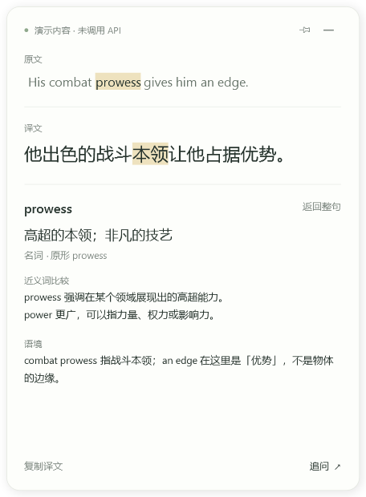
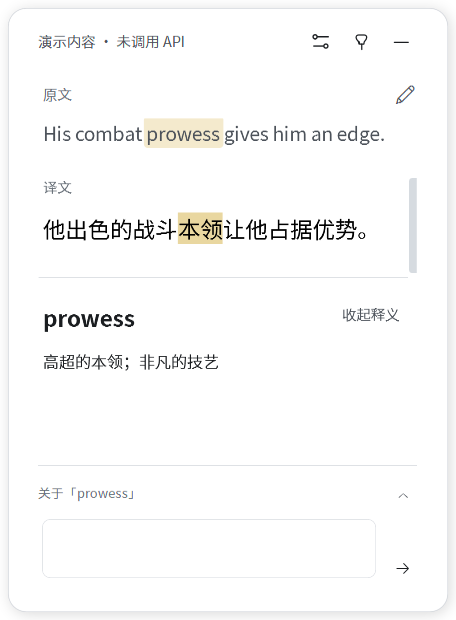
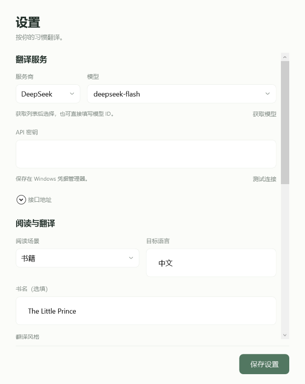
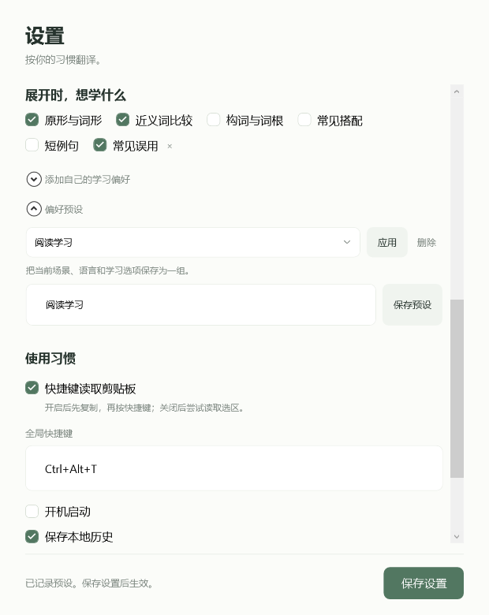
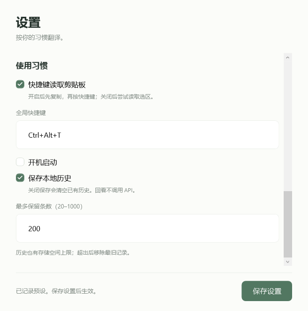
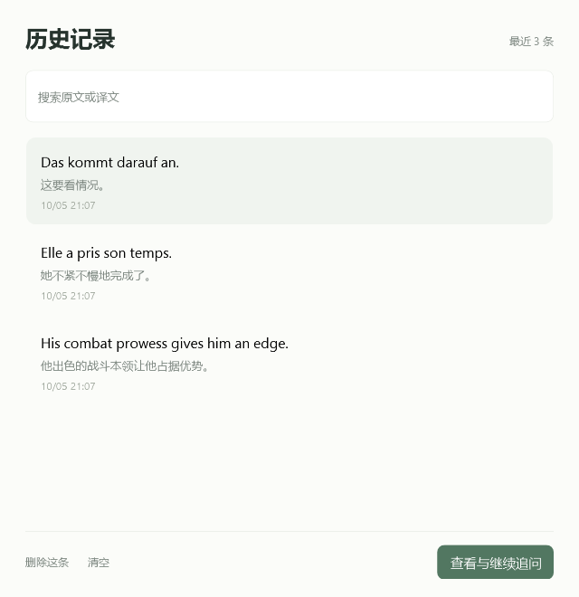

# Leaf · 叶译

**简体中文** | [English](README.en.md)

**读到不懂的词句，按一下快捷键。**

叶译是一款 Windows 桌面翻译工具。复制或选中文字，就能在小浮窗里查看译文；点击原文中的词继续学习，也可以围绕这段内容追问。

使用自己的 **智谱、千问或 DeepSeek API**。原文语言自动识别，目标语言和学习方式由你设置，适合阅读书籍、浏览网页、查看技术文档或理解游戏里的文字。

[下载 Windows 版](https://github.com/Inmata/leaf-translate/releases/latest) · [快速开始](#快速开始) · [界面预览](#界面预览) · [问题反馈](https://github.com/Inmata/leaf-translate/issues)

## 主要功能

- **随手翻译**：默认先复制，再按 `Ctrl+Alt+T`；也可以切换到直接读取选中文字。
- **在原句里学词**：点击单词，查看当前语境下的释义、词性和原形，按偏好展开近义词、构词、搭配或例句。
- **接着问下去**：在同一浮窗里追问整句或某个词，原文和译文始终保留。
- **用选项设置学习方式**：选择阅读场景和学习内容；缺少合适选项时，再添加自己的要求。常用组合可以保存为预设。
- **回看本地历史**：搜索原文或译文，恢复词卡和对话，继续追问。默认保存最近 200 条，可删除、清空或关闭保存。
- **按自己的桌面习惯使用**：唤起时保留原软件焦点，支持置顶、拖动和调整大小，自动记住位置与尺寸；快捷键可改为 `Alt+Space`。

## 下载与安装

到 [Releases 下载最新版本](https://github.com/Inmata/leaf-translate/releases/latest)，选择 **`Leaf-v版本号-windows.zip`**，不要把 GitHub 自动生成的 `Source code` 压缩包当成运行程序。

1. 把 ZIP **完整解压**到一个固定文件夹。
2. 保持 `Leaf.exe` 和 `Leaf.exe.config` 在同一目录，双击 `Leaf.exe`。
3. 首次启动会打开设置。配置好 API 后即可使用。

| 项目 | 要求或说明 |
| --- | --- |
| 系统 | Windows 10 / 11 |
| 运行环境 | [.NET Framework 4.8](https://dotnet.microsoft.com/en-us/download/dotnet-framework/net48)；较新的 Windows 通常已包含 |
| 软件界面 | 当前版本为中文；提供完整英文文档 |
| 翻译语言 | 自动识别原文；目标语言默认中文，可修改 |
| API | 需要自己的 API 密钥和可用模型；用量由服务商计费 |

叶译是便携程序。开机启动默认关闭，使用时会驻留在系统托盘。

## 快速开始

### 1. 配置翻译服务

在设置中选择服务商，填写自己的 **API 密钥**，再点击 **「获取模型」**，从服务商返回的列表中选择模型。新设置不预填固定模型名称，也不会替你选用某个付费模型。

| 服务商 | 官方说明 |
| --- | --- |
| 智谱 | [智谱开放平台文档](https://docs.bigmodel.cn/) |
| 千问 | [阿里云百炼文档](https://help.aliyun.com/zh/model-studio/) |
| DeepSeek | [DeepSeek API 文档](https://api-docs.deepseek.com/) |

模型框也能直接输入模型 ID。部分服务或兼容接口不提供模型列表，此时按官方文档填写即可；接口地址已提供默认值，可在展开项中修改。列表中出现的模型不代表账号已开通，仍需测试连接确认。

点击 **「测试连接」**，成功后再点击 **「保存设置」**。测试会发送一次短请求，可能计入 API 用量。模型是否可用、是否免费，以服务商账号和当前规则为准。

没有密钥也可以先体验界面：在解压目录打开 PowerShell，运行 `.\Leaf.exe --demo`。演示内容会明确标记，不调用 API。

### 2. 翻译一段文字

默认开启**剪贴板模式**：

1. 在浏览器、阅读器或其他软件里选中文字。
2. 按 `Ctrl+C` 复制。
3. 按 **`Ctrl+Alt+T`**，等待浮窗显示译文。

想直接选中后按快捷键，可以在托盘菜单中关闭 **「剪贴板模式」**，或在设置中取消 **「快捷键读取剪贴板」**。部分软件无法直接取词，这时手动复制更可靠。

剪贴板模式只在你按快捷键时读取文字，每次复制不会自动触发翻译。

### 3. 查词与追问

点击原文中的词，展开词卡。例如读到 `prowess`，可以查看它在原句里的意思，并按「近义词比较」偏好了解它与 `power` 的区别。

遇到短语或不便逐词点击的文字，可以在浮窗原文中拖选一段，再右键选择 **「解释选中片段」**。

点击 **「追问」** 才会出现输入框。问题围绕当前词语或原句展开；点击 **「返回整句」** 可以切回原句。`Enter` 发送，`Shift+Enter` 换行。

## 界面预览

以下截图来自 v0.2.0 窗口，文字、模型选项、问答与历史记录均为演示内容，未调用真实 API。点击图片可以查看大图。

<table>
  <tr>
    <td valign="top" width="50%">
      <strong>翻译与词卡</strong> 
      保留原句，点击词语展开解释；能够确认对应片段时同步高亮译文。  
      
    </td>
    <td valign="top" width="50%">
      <strong>继续追问</strong> 
      围绕同一段内容继续提问，查看已保存的问答，输入框按需展开。  
      
    </td>
  </tr>
  <tr>
    <td valign="top">
      <strong>API 与阅读语境</strong> 
      选择服务、模型、阅读场景和目标语言，填写场景对应的补充信息。  
      
    </td>
    <td valign="top">
      <strong>学习偏好与预设</strong> 
      勾选想学的内容，添加自定义项，把常用组合保存下来。  
      
    </td>
  </tr>
  <tr>
    <td valign="top">
      <strong>使用习惯</strong> 
      调整取词模式、快捷键、开机启动和历史保存。  
      
    </td>
    <td valign="top">
      <strong>历史记录</strong> 
      搜索原文或译文，恢复一条记录，接着学习和追问。  
      
    </td>
  </tr>
</table>

## 设置自己的学习方式

阅读场景提供 **通用、书籍、影视、技术文档、游戏、自定义**。这些场景不限定语言：书籍可以是法语小说，技术文档也可以是德语资料。选择某个场景后，才显示相应的选填信息，例如书名或游戏名称。

展开词卡时，叶译根据勾选项讲解：

| 学习选项 | 可以得到什么 |
| --- | --- |
| 原形与词形 | 原形、词性，以及当前词形与原形的关系 |
| 近义词比较 | 容易混淆的词在含义和用法上的区别 |
| 构词与词根 | 有依据的构词解释；区分词源与记忆联想 |
| 常见搭配 | 符合当前语境的常用搭配 |
| 短例句 | 贴近当前场景的例句与译文 |

如果选项不够，展开 **「添加自己的学习偏好」**，填写一个名称和希望怎样讲解。例如：

> **名称：** 常见误用
>
> **希望怎样讲解：** 解释容易混淆的用法，并给一个短例句。

添加后，它就成为可勾选的学习项。还可以把目标语言、场景与学习选项保存为 **「偏好预设」**，以后直接应用。编辑完成后记得点击 **「保存设置」**。

## 快捷键与窗口

| 操作 | 作用 |
| --- | --- |
| `Ctrl+Alt+T` | 翻译选区或剪贴板内容；可在设置中修改 |
| 点击原文词语 | 打开当前语境下的词卡 |
| 追问中的 `Enter` / `Shift+Enter` | 发送问题 / 换行 |
| 点击浮窗外部 | 收起未置顶的浮窗，保留会话和草稿 |
| 点击右上角置顶按钮 | 保持显示；追问不会自动置顶 |
| 点击收起按钮 | 隐藏浮窗，继续托盘驻留 |
| 托盘右键 → 退出 | 结束程序 |

浮窗首次在主屏右侧显示。把它拖到喜欢的位置、调整大小后，下次唤起与重新启动都会恢复；重试不会改变可见窗口的位置。可以直接拖到副屏，无需选择显示器；屏幕移除后窗口会回到可用区域。

浮窗显示时会出现在任务栏，收起后继续保留托盘图标。`Alt+Space` 可在设置中使用；叶译运行时会用该组合翻译，代替 Windows 的窗口菜单。如果其他快捷键工具也用了同一组合，请在其中一处更改。

唤起浮窗不会主动切走原软件的焦点，点击浮窗后再交互。设置和历史记录都可以从托盘菜单打开；找不到图标时，查看任务栏的隐藏图标区域。

## 数据与隐私

**API 密钥保存在 Windows 凭据管理器。** 设置和历史位于 `%LOCALAPPDATA%\LeafTranslate`，不会把密钥写进历史文件。

翻译、查词、追问和测试连接会向你设置的 API 地址发送请求。翻译携带原文与场景；查词和追问还会携带相关译文、学习偏好或最近的对话。获取模型只查询该服务的模型目录，不发送阅读内容。叶译没有自建中转服务器。

历史保存在本机，打开历史不会调用 API。默认保留最近 200 条，在设置中可调整数量或关闭保存；**关闭保存会清空已有历史**。删除、清空历史也会移除相应缓存。

## 常见问题

### 无法直接读取选中文字？

有些阅读器、自绘界面或权限较高的软件不支持直接取词。切回剪贴板模式，先手动复制再按快捷键。文字只存在于图片里时，需要其他工具先识别出来，叶译当前没有 OCR。

### 快捷键没有反应？

先确认叶译仍在托盘运行。若提示快捷键被占用，在设置中换一个包含 `Ctrl`、`Alt` 或 `Win` 的组合。

### 密钥填写后仍然失败？

检查服务商、模型、API 地址和账号额度。网络、超时、密钥错误、限流及格式异常会显示对应提示。「测试连接」成功后仍需保存设置。重新打开设置时，密钥框留空且下方显示「已保存密钥」，这是正常的；留空可以继续使用，修改 API 地址后必须重新填写。

### 可以使用其他语言或其他兼容服务吗？

可以修改目标语言，原文语言由模型识别。模型名和 HTTPS 接口地址也可编辑；其他兼容服务的参数和行为可能不同，需要自行验证。当前软件界面仍是中文。

### 为什么关掉浮窗后程序还在运行？

收起浮窗会保留会话，方便下次使用。要完全结束程序，在托盘右键选择「退出」。开机启动可选，默认关闭。

### 首版有哪些限制？

当前仅支持 Windows，不包含 OCR、截图翻译或独占全屏游戏适配。逐词点击的效果受文字分词方式影响，可用拖选片段补充。跨软件取词和多屏表现可能因桌面环境而异；LLM 的释义、词源与翻译也可能出错，重要内容请核对。

## 文档与反馈

- [完整使用说明](docs/USAGE.md)
- [English user guide](docs/USAGE.en.md)
- [开发与贡献](CONTRIBUTING.md)
- [报告问题或提出建议](https://github.com/Inmata/leaf-translate/issues)

反馈问题时，附上软件版本、Windows 版本、取词模式和复现步骤即可；请不要提交 API 密钥。
